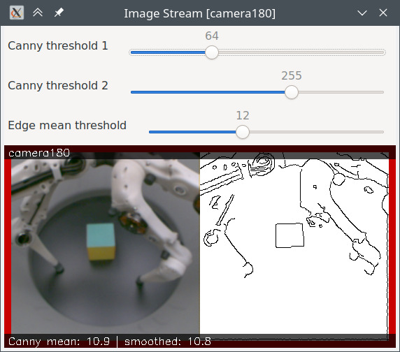

***********
Executables
***********

The package contains a number of executables for calibration, testing, data
analysis, etc.

.. note::

   All executables described here can be run via ``ros2 run``, i.e. like this:

   .. code-block:: sh

       $ ros2 run trifinger_cameras <executable_name> <args ...>

   This part is omitted in the examples below for better readability but should be added
   when actually executing them.

.. todo::

   The following executables are not yet documented.  In many cases you can get
   some information by running them with ``--help``, though.

   - analyze_tricamera_log
   - calibrate_cameras
   - calibrate_trifingerpro_cameras
   - camera_log_viewer
   - charuco_board
   - convert_to_camera_pose
   - detect_aruco_marker
   - load_camera_config_test
   - overlay_camera_stream
   - overlay_real_and_rendered_images
   - record_image_dataset
   - tricamera_log_converter
   - tricamera_log_viewer
   - tricamera_test_connection

Demo Applications
=================

There are two demo applications to illustrate how to access the camera images
in your code:

- ``demo_camera.py`` for a single camera.  This works with both a Pylon camera
  or (set the ``--pylon`` flag in this case) or a regular webcam.
- ``demo_tricamera.py`` for a set of three Pylon cameras (like in the TriFinger
  platforms).

Apart from showing how to use the software, they can also be useful as simple
viewer applications for basic tests.

Run with ``--help`` to get a full list of options for each demo.

.. _executable_check_camera_sharpness:

check_camera_sharpness
======================

Show live image of a Pylon camera and indicate whether it passes the sharpness
test.

The sharpness of the image is evaluated by running Canny edge detection on the
image and computing the mean value of the resulting edge image.  A higher value
means more edges which indicates a sharper image.

The result of the edge detection is shown in the GUI next to the camera image.
The parameters can be adjusted via the sliders (note that the sliders in the GUI
only support integer values, the actual parameters can also be float values).

The border around the image indicates if the smoothed edge mean is below (red)
or above (green) the threshold.

This test is also performed in robot_fingers/trifingerpro_post_submission.py
(the self-test that is run after each job on the TriFingerPro robots).

As argument, the ID of the camera needs to be passed.  Example:

::

    check_camera_sharpness camera180

Additional arguments can be used to set initial values for the parameters.  Run
with ``--help`` to get a complete list.

.. _executable_pylon_list_cameras:

pylon_list_cameras
==================

List all currently connected Pylon cameras.  Doesn't expect any arguments, i.e. simply
run

.. code-block:: sh

    $ pylon_list_cameras

.. _executable_pylon_write_device_user_id_to_camera:

pylon_write_device_user_id_to_camera
====================================

Writes the "DeviceUserID" to a Pylon camera.  This ID is needed to distinguish cameras
if multiple of them are connected.  See also :ref:`pylon_set_device_user_id`.

Expects as argument the ID and writes it to the first camera found, so **make sure no
other camera is connected** before running the command.

.. code-block:: sh

    $ pylon_write_device_user_id_to_camera "some_id"

Once written, the "DeviceUserID" will be displayed by the PylonViewerApp (unfortunately
it's not possible to modify it there).

.. _executable_pylon_dump_camera_settings:

pylon_dump_camera_settings
==========================

Connect to a Pylon camera and print its settings to stdout.  When saved to a file, this
can be used as ``pylon_settings_file`` in the Pylon driver (see :ref:`settings`).

Usage (saving the settings to a file "camera_settings.txt":

.. code-block:: sh

   $ pylon_dump_camera_settings "device_user_id" > camera_settings.txt
